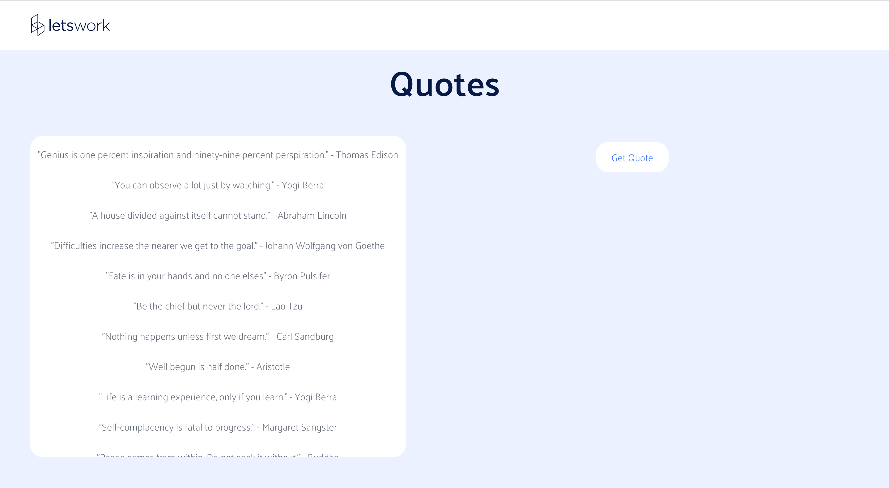

# Random Quote Generator

This is a simple web application built in **React.js** that gets quotes from an external website, randomly selects one of them and allows the user to share the random quote to twitter.

The design of the page is based on the design of the [Letswork homepage](https://www.letswork.io/). It looks like this:



To run locally:

1. Clone the repository. You can use the URL given in the <>Code option at the top right corner.

```sh
$ git clone https://github.com/arshiya-k/randomQuoteGenerator.git
```

2. Run it from the **root directory** with the command

```sh
npm run start
```
